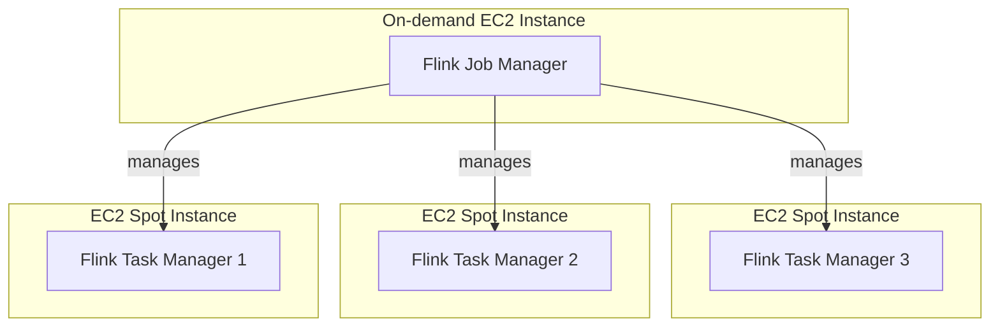

# Open Tofu, AWS, Apache Flink

Using OpenTofu to create an Apache Flink cluster, with Task Managers in an auto scaling group of Spot instances to help reduce costs

### Create a base image AMI using Packer

First, add your VPC IP and Subnet in to packer/variables.json

Validate the packer file

```
packer validate --var-file=variables.json flink.json
```

Build the AMI from the packer file

```
packer build --var-file=variables.json flink.json
```


### Flink cluster diagram

A diagram of the resulting Flink cluster created using this Tofu project:




### Estimated cost

```
Project: gordonmurray/tofu_aws_apache_flink

 Name                                                  Monthly Qty  Unit     Monthly Cost

 aws_autoscaling_group.flink_taskmanagers_spot_1
 └─ aws_launch_template.flink_taskmanagers_spot_1
    ├─ Instance usage (Linux/UNIX, spot, m7g.large)            730  hours          $24.60
    ├─ EC2 detailed monitoring                                   7  metrics         $2.10
    └─ block_device_mapping[0]
       └─ Storage (general purpose SSD, gp2)                    50  GB              $5.50

 aws_autoscaling_group.flink_taskmanagers_spot_2
 └─ aws_launch_template.flink_taskmanagers_spot_2
    ├─ Instance usage (Linux/UNIX, spot, m7g.xlarge)           730  hours          $55.33
    ├─ EC2 detailed monitoring                                   7  metrics         $2.10
    └─ block_device_mapping[0]
       └─ Storage (general purpose SSD, gp2)                    50  GB              $5.50

 aws_instance.flink_job_managers[0]
 ├─ Instance usage (Linux/UNIX, on-demand, m7g.large)          730  hours          $66.43
 └─ root_block_device
    └─ Storage (general purpose SSD, gp3)                       50  GB              $4.40

 OVERALL TOTAL                                                                    $165.97
──────────────────────────────────
12 cloud resources were detected:
∙ 3 were estimated, all of which include usage-based costs, see https://infracost.io/usage-file
∙ 9 were free:
  ∙ 2 x aws_iam_role_policy_attachment
  ∙ 2 x aws_launch_template
  ∙ 1 x aws_iam_instance_profile
  ∙ 1 x aws_iam_policy
  ∙ 1 x aws_iam_role
  ∙ 1 x aws_key_pair
  ∙ 1 x aws_security_group

┏━━━━━━━━━━━━━━━━━━━━━━━━━━━━━━━━━━━━━━━━━━━━━━━━━━━━┳━━━━━━━━━━━━━━┓
┃ Project                                            ┃ Monthly cost ┃
┣━━━━━━━━━━━━━━━━━━━━━━━━━━━━━━━━━━━━━━━━━━━━━━━━━━━━╋━━━━━━━━━━━━━━┫
┃ gordonmurray/tofu_aws_apache_flink                 ┃ $166         ┃
┗━━━━━━━━━━━━━━━━━━━━━━━━━━━━━━━━━━━━━━━━━━━━━━━━━━━━┻━━━━━━━━━━━━━━┛
```