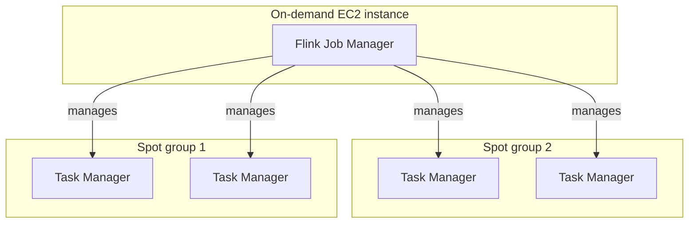

# Open Tofu, AWS, Apache Flink

Use OpenTofu to create an Apache Flink cluster, with Task Managers in an auto scaling group of Spot instances to help reduce costs

[Terraforms provider for Ansible](https://registry.terraform.io/providers/ansible/ansible/latest/docs) is used to run an Ansible playbook which submits a Flink SQL workloads to the Flink Job Manager.

A simple Flink SQL workload is added to generate some fake events.

```sql
CREATE TEMPORARY TABLE Events (
    id INT,
    message STRING
) WITH (
    'connector' = 'datagen',
    'rows-per-second'='5',
    'fields.id.kind'='random',
    'fields.id.min'='1',
    'fields.id.max'='100',
    'fields.message.length'='10'
);

SELECT * FROM Events;
```


### 1. Create a base image AMI using Packer

First, add your VPC IP and Subnet in to `packer/variables.json`

Validate the packer file

```bash
packer validate --var-file=variables.json flink.json
```

Build the AMI from the packer file

```
packer build --var-file=variables.json flink.json
```


### 2. Enable Ansible

Install Ansible

```
sudo apt install ansible -y
```

Install the Ansible provider for Terraform
```
ansible-galaxy collection install cloud.terraform
```

### 3. Update Variables

Add your AWS Account ID, VPC ID and subnets to `terraform.tfvars`.

Next use Open Tofu to create the infrastructure:

### 4. Create the cluster

```
tofu init

fofu plan

tofu apply
```

Once Tofu has finished, it will show an endpoint you can open in your browser, similar to `http://localhost:8083`. This will open up the Flink UI in your browser.


In your AWS account you will see 3 new EC2 instances.


### 5. Adding Flink workloads

You can add additional Flink SQL workloads to Flink either by updating the file at `roles/flink_jobs/templates/queries.sql.j2` or create new Roles in `roles/` using the `flink_jobs` folder as a template.

### Debugging Ansible playbook

Tofu runs the Ansible playbook automatically. If you'd like to record its output, you can set an ANSIBLE_LOG_PATH environment variable.

```
export ANSIBLE_LOG_PATH=./ansible.log
```

In `ansible_playbook.tf`, there are 2 variables that are useful to change if you want the playbook to run every time you run Tofu, or if you'd like Tofu to stop if there are Ansible errors.

```
replayable              = true # set to true if you want to run the playbook every time
ignore_playbook_failure = true # set to true if you want Tofu to keep running if there is an Ansible error
```


### Flink cluster diagram

A diagram of the resulting Flink cluster created using this Tofu project:



### Estimated cost

```
Project: gordonmurray/tofu_aws_apache_flink

 Name                                                  Monthly Qty  Unit     Monthly Cost

 aws_autoscaling_group.flink_taskmanagers_spot_1
 └─ aws_launch_template.flink_taskmanagers_spot_1
    ├─ Instance usage (Linux/UNIX, spot, m7g.large)            730  hours          $23.87
    ├─ EC2 detailed monitoring                                   7  metrics         $2.10
    └─ block_device_mapping[0]
       └─ Storage (general purpose SSD, gp2)                    50  GB              $5.50

 aws_autoscaling_group.flink_taskmanagers_spot_2
 └─ aws_launch_template.flink_taskmanagers_spot_2
    ├─ Instance usage (Linux/UNIX, spot, m7g.xlarge)           730  hours          $55.77
    ├─ EC2 detailed monitoring                                   7  metrics         $2.10
    └─ block_device_mapping[0]
       └─ Storage (general purpose SSD, gp2)                    50  GB              $5.50

 aws_instance.flink_job_managers[0]
 ├─ Instance usage (Linux/UNIX, on-demand, t4g.large)          730  hours          $53.73
 └─ root_block_device
    └─ Storage (general purpose SSD, gp3)                       50  GB              $4.40

 OVERALL TOTAL                                                                    $152.97
──────────────────────────────────
17 cloud resources were detected:
∙ 3 were estimated, all of which include usage-based costs, see https://infracost.io/usage-file
∙ 14 were free:
  ∙ 5 x aws_security_group_rule
  ∙ 2 x aws_iam_role_policy_attachment
  ∙ 2 x aws_launch_template
  ∙ 1 x aws_iam_instance_profile
  ∙ 1 x aws_iam_policy
  ∙ 1 x aws_iam_role
  ∙ 1 x aws_key_pair
  ∙ 1 x aws_security_group

┏━━━━━━━━━━━━━━━━━━━━━━━━━━━━━━━━━━━━━━━━━━━━━━━━━━━━┳━━━━━━━━━━━━━━┓
┃ Project                                            ┃ Monthly cost ┃
┣━━━━━━━━━━━━━━━━━━━━━━━━━━━━━━━━━━━━━━━━━━━━━━━━━━━━╋━━━━━━━━━━━━━━┫
┃ gordonmurray/tofu_aws_apache_flink                 ┃ $153         ┃
┗━━━━━━━━━━━━━━━━━━━━━━━━━━━━━━━━━━━━━━━━━━━━━━━━━━━━┻━━━━━━━━━━━━━━┛
```

#### Notes

* This project deploys the instances in a public subnet. For a real world deployment it is best to deploy in to a private subnet.
* If you want to remove the Flink cluster and its resources, use `tofu destroy`.
