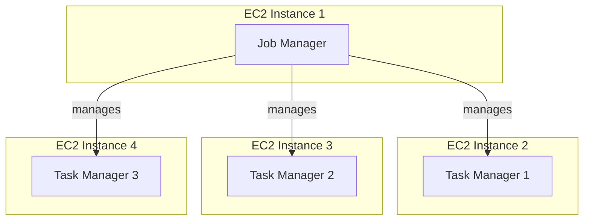

# Open Tofu, AWS, Apache Flink


### Diagram




### Estimated cost

```

 Name                                                 Monthly Qty  Unit     Monthly Cost

 aws_autoscaling_group.flink_taskmanagers_spot
 └─ aws_launch_template.flink_taskmanagers_spot
    ├─ Instance usage (Linux/UNIX, spot, m5.large)            730  hours          $29.27
    ├─ EBS-optimized usage                                    730  hours           $0.00
    ├─ EC2 detailed monitoring                                  7  metrics         $2.10
    └─ block_device_mapping[0]
       └─ Storage (general purpose SSD, gp2)                   50  GB              $5.00

 aws_instance.flink_job_managers[0]
 ├─ Instance usage (Linux/UNIX, on-demand, m5.large)          730  hours          $70.08
 └─ root_block_device
    └─ Storage (general purpose SSD, gp3)                      50  GB              $4.00

 OVERALL TOTAL                                                                   $110.45
──────────────────────────────────
10 cloud resources were detected:
∙ 2 were estimated, all of which include usage-based costs, see https://infracost.io/usage-file
∙ 8 were free:
  ∙ 2 x aws_iam_role_policy_attachment
  ∙ 1 x aws_iam_instance_profile
  ∙ 1 x aws_iam_policy
  ∙ 1 x aws_iam_role
  ∙ 1 x aws_key_pair
  ∙ 1 x aws_launch_template
  ∙ 1 x aws_security_group

┏━━━━━━━━━━━━━━━━━━━━━━━━━━━━━━━━━━━━━━━━━━━━━━━━━━━━┳━━━━━━━━━━━━━━┓
┃ Project                                            ┃ Monthly cost ┃
┣━━━━━━━━━━━━━━━━━━━━━━━━━━━━━━━━━━━━━━━━━━━━━━━━━━━━╋━━━━━━━━━━━━━━┫
┃ .                                                  ┃ $110         ┃
┗━━━━━━━━━━━━━━━━━━━━━━━━━━━━━━━━━━━━━━━━━━━━━━━━━━━━┻━━━━━━━━━━━━━━┛
```